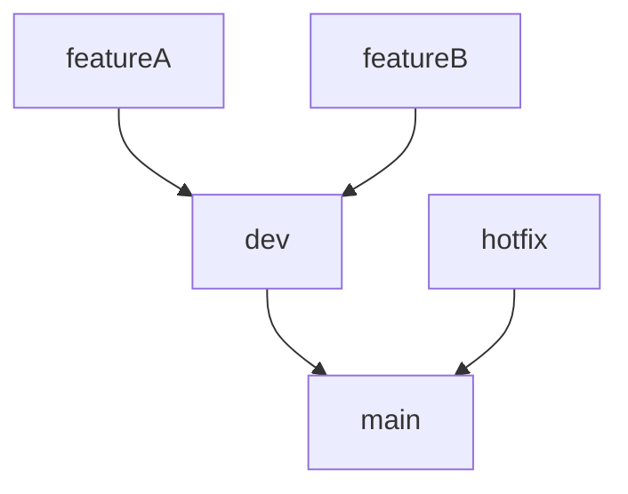

# 🔁 BLOCO 10 — LÓGICA DE DEPLOY, VERSIONAMENTO E INTEGRAÇÃO GIT / VERCEL

Este documento estabelece a **estratégia de deploy profissional e controle de versões da plataforma V4SalesGrowth**, garantindo rastreabilidade, segurança e integração contínua com GitHub e Vercel.

---

## ⚙️ 01 — ESTRUTURA DO GIT

### ✅ Repositório oficial:
```
https://github.com/LucasBilinski/V4SalesGrowth.git
```

### 🌱 Branches:
| Branch               | Finalidade                          |
|----------------------|--------------------------------------|
| `main`               | Produção oficial                     |
| `dev`                | Desenvolvimento ativo                |
| `refatoracao-v111`   | Snapshot da versão antes da transição do Cursor |
| `restauracao-final`  | Base limpa recuperada e redeployada |

> Sempre que necessário, criar branches de feature como `feature/nome`, e abrir PRs para `dev`.

---

## 🔄 02 — FLUXO DE GIT PROFISSIONAL (GITFLOW)



### 📦 Comandos padrão:

```bash
git checkout -b feature/analytics
git add .
git commit -m "feat: adiciona painel de analytics"
git push origin feature/analytics
```

### ✅ Pull Request:

- Deve ser revisado por 1 membro (ou você mesmo via comparação)
- Usar `Squash & Merge` para limpar histórico

---

## ☁️ 03 — INTEGRAÇÃO COM VERCEL

### Projeto conectado:
```
Vercel: v0-v4-sales-growth-by-v4
```

### 🧩 Ligação:
- Ao dar `push` na branch principal (`main` ou `dev`) → a Vercel dispara deploy automático
- A Vercel detecta automaticamente mudanças e refaz build
- Ambiente `Production` = branch `main`
- Ambiente `Preview` = branches secundárias

---

## 📦 04 — VARIÁVEIS DE AMBIENTE NO VERCEL

Local: `Settings > Environment Variables`

### Boas práticas:
- Use prefixos: `NEXT_PUBLIC_` para frontend
- Use `SUPABASE_`, `STRIPE_`, `OPENAI_`, etc
- Marcar como “All Environments”
- Desmarcar “Use existing build cache” ao dar redeploy manual

---

## 🏷️ 05 — VERSIONAMENTO POR TAGS (SEMVER)

- Tags devem seguir padrão: `v1.0.0`, `v1.0.1`, etc

### Exemplo:

```bash
git tag v1.2.0
git push origin v1.2.0
```

> A Vercel reconhece tags e permite criar builds marcados por versão.

---

## 🚀 06 — DEPLOY MANUAL (SE NECESSÁRIO)

1. Vá no painel do projeto na Vercel
2. Vá em Deployments
3. Clique no deploy que deseja promover
4. Clique em “Redeploy”
5. ⚠️ Desmarque “Use Build Cache”
6. Aguarde rebuild completo

---

## 🧪 07 — AMBIENTE DE TESTES (PREVIEW)

### Para revisar funcionalidades sem afetar produção:
- Crie uma branch `feature/...`
- Suba seu código
- A Vercel criará um link `preview-v4salesgrowth...vercel.app`
- Compartilhe esse link para validação antes de promover

---

## 🧱 08 — BOAS PRÁTICAS DE DEPLOY

| Item                           | Status |
|--------------------------------|--------|
| Integração GitHub ↔ Vercel     | ✅     |
| `.env.example` versionado      | ✅     |
| `.env.local` ignorado          | ✅     |
| Deploy com logs monitorados    | ✅     |
| Tags `vX.Y.Z` utilizadas       | [ ]    |
| Build cache desativado         | ✅     |
| Histórico de deploys limpo     | ✅     |

---

## 🧠 09 — POLÍTICA DE COMMIT (PADRÃO CONVENCIONAL)

Exemplos:

- `feat: adiciona nova tela de diagnóstico`
- `fix: corrige bug no middleware`
- `chore: atualiza dependências`

---

## ✅ CHECKLIST FINAL

| Etapa                                | Status |
|--------------------------------------|--------|
| Git com controle de branches ativo   | ✅     |
| Deploy contínuo configurado na Vercel| ✅     |
| Variáveis corretas na Vercel         | ✅     |
| Deploy limpo sem cache               | ✅     |
| Deploy promovido                     | ✅     |
| Backup com tag                       | [ ]    |

---

Este bloco garante que **todas as entregas estejam bem organizadas, versionadas e rastreáveis**, com deploys seguros e monitorados.
